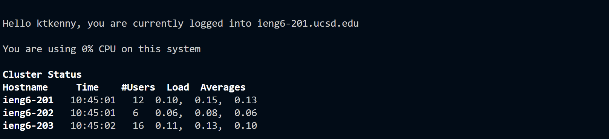
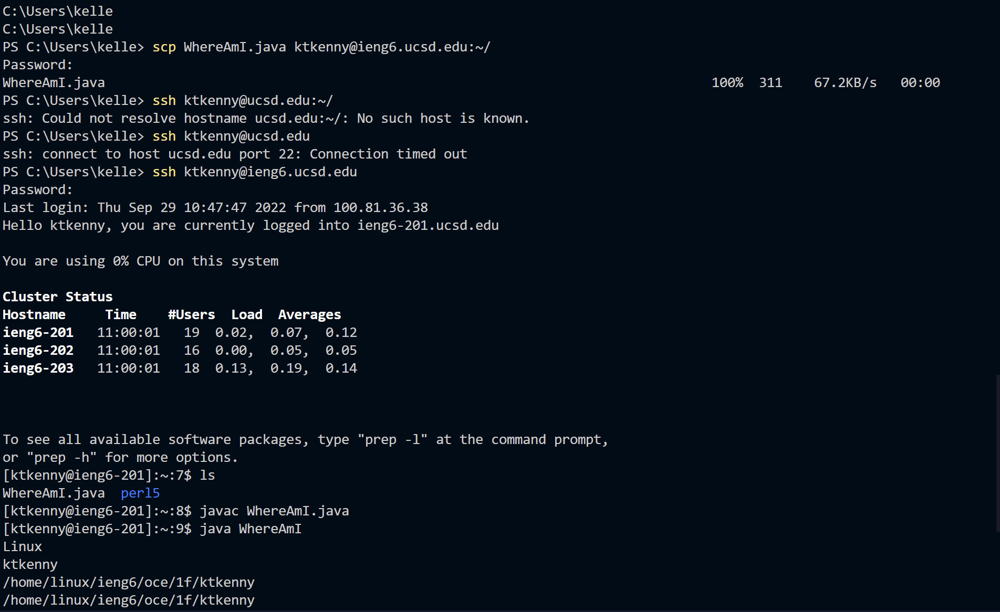
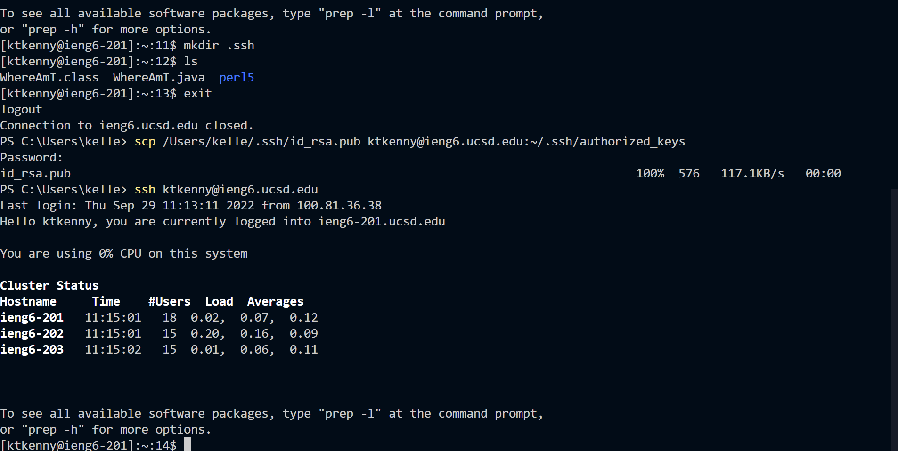

# How to install VScode to remote connecting

## Installing VScode
To start off you must got to [this](https://code.visualstudio.com/) to download the VScode and go throught the wizard! Once you are done with that you should open VSCode and it should look like the picture below

Once that is done you are going to got to the top of VScode and click on the **Terminal** and you are going to click on it and select **New Terminal**
 
## Remotely Connecting
Once a terminal is now open you will need to go into the terminal and type 
`ssh cs15lfa22jt@ieng6.ucsd.edu` but the *jt* will be your own personal code. One that happens you will need to type your password in. The keystokes are being monitored when you put your password in but it will not show. If it is your first time logging intoThe image below shows what text will come up if you are connected to the server.

## Trying Some Commands
Now that you are in a server and are connected try running these commands on your computrer and the remote coimputer
1. cd ~
2. cd
3. ls 
4. ls -lat
5. ls -a
6. ls <directory> where <directory> is /home/linux/ieng6/cs15lfa22/cs15lfa22abc, where the abc is one of the other group members’ username
7. cp /home/linux/ieng6/cs15lfa22/public/hello.txt ~/
8. cat /home/linux/ieng6/cs15lfa22/public/hello.txt`

It should look similar to the picture above whether you have the commands in your personal computer or the server.

## Moving Files with scp
 Now you must creat a file called `WhereAmI.java` in VScode and then you have to put this into the file:
     # class WhereAmI {
        public static void main(String[] args) {
        System.out.println(System.getProperty("os.name"));
        System.out.println(System.getProperty("user.name"));
        System.out.println(System.getProperty("user.home"));
        System.out.println(System.getProperty("user.dir"));
    }
}

Complie and run this on your main computer with the commands below.
 
     # javac WhereAmI.java
     java WhereAmI

   Once you do that you are now going to use scp to transfer a file from your computer to the remote computer. Youre going to type `scp WhereAmI.java cs15lfa22jt@ieng6.ucsd.edu:~/` with your own letters. Now you will type in your password and it should got through. To check you will remote connect and try the java commands again. It should look like this:

## Setting an SSH Key
An SSH Key lets you login to the remote computer with no password. To start you are going to type `ssh-keygen` there will be prompts aftewr that that will ask you where you want your file to go just hit `enter` as it will put it in a default spot. Now that you have made a public and private key you have to copy it to the remote computer. Login into the remote computer and type `mkdir .ssh` then logout. Now you are going to scp your public key which is in your .ssh folder and it should say `id_rsa.pub` and you are going to type `scp /Users/Kelley/.ssh/id_rsa.pub cs15lfa22@ieng6.ucsd.edu:~/.ssh/authorized_keys` with your own file loaction of course. Once that is done it should look like this:

## Optimizing Remote Running
There are many ways to optimize Remote running. I was able to only use 4 keystokes when logging in by using the up arrow to access old commands. There are also many way to optimzes setting code like putting a command in quotations in the end of the ssh command like this `ssh cs15lfa22jt@ieng6.ucsd.edu "ls"` and that would look like this:

Thats everything! Now you can Remote run things and much more!
