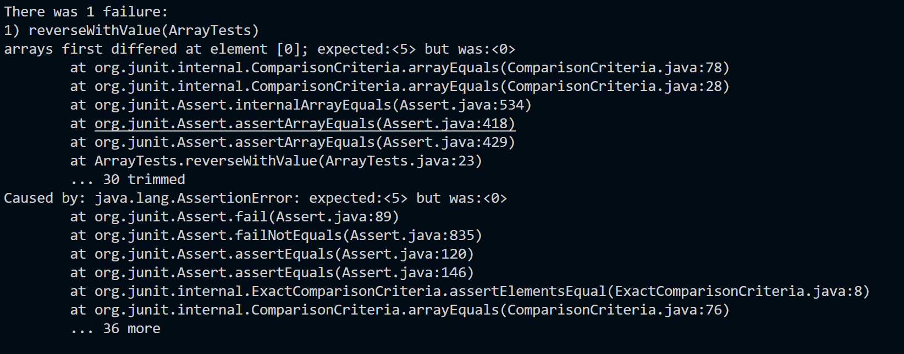
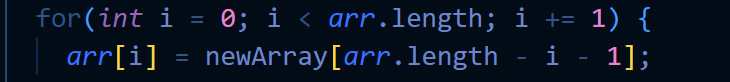

# Search Engine and DeBugging using JUnit.

## Search Engine
     
     import java.io.IOException;
     import java.net.URI;
     import java.util.ArrayList;

     class Handler implements URLHandler {
     // The one bit of state on the server: a number that will be manipulated by
     // various requests.
     ArrayList<String> words = new ArrayList<String>();
     
     public String handleRequest(URI url) {
        if (url.getPath().equals("/")) {
            return String.format("Welcome to my Search Engine \n To add to the engine do '/add?=' then what you would want to add \n To Search type '/search?=' then what you want to search");
        }
        else if(url.getPath().contains("/add"))
        {
            String[] parameters = url.getQuery().split("=");
            words.add(parameters[1]);
            return String.format("Documented!");
        }
        else if(url.getPath().contains("/search"))
        {
            String s= "";
            String[] parameters = url.getQuery().split("=");
            for(int x = 0;x < words.size(); x++)
            {
                if(words.get(x).contains(parameters[1]))
                {
                    s += words.get(x) + "\n";
                }
            }
            if(s.equals(""))
            {
                return String.format("We have found nothing");
            }
            else
            {
            return String.format("We found these: %s", s);
            }
        } 
        else
        return "404 Not Found!";
      }
     }
    

     class SearchEngine {
        public static void main(String[] args) throws IOException {
            if(args.length == 0){
                System.out.println("Missing port number! Try any number between 1024 to 49151");
                return;
            }
    
            int port = Integer.parseInt(args[0]);
    
            Server.start(port, new Handler());
        }
     }

Above is the code to the search Engine I created last week. Below this is a picutre of the default screen when first loading up the page. It utilizes this code:

         if (url.getPath().equals("/")) {
                return String.format("Welcome to my Search Engine \n To add to the engine do '/add?=' then what you would want to add \n To Search type '/search?=' then what you want to search");

This is the load up picture:

The next picutre shows what happens iuf you add something to the database to look up. 

It utilizes this part of the code

        else if(url.getPath().contains("/add"))
         {
             String[] parameters = url.getQuery().split("=");
             words.add(parameters[1]);
             return String.format("Documented!");

If it detects '/add' in the URL and then it adds what ever is aftewr the '?=' and adds it to the arraylist of strings. It lets you know thast it was added by saying "Documented"

The next picture of the website is the search function and what it is meant for. The engine uses '.contains()' to bring up things that you might be looking for or somthings similar in the picture I looked up "oo" and the three words that I added with "oo" in it are shown.

It utilizes this:

        String s= "";
             String[] parameters = url.getQuery().split("=");
                for(int x = 0;x < words.size(); x++)
             {
                    if(words.get(x).contains(parameters[1]))
                    {
                       s += words.get(x) + "\n";

## Debugging using JUnit
We were given many different java files all with multiple methods that had bugs and some taht were bug free. The fist method I want to talk about is the Reverse method in the Arraylist class. I made a test method that should have output a new arraylist of ints in reverse, below is that test.

When I ran this code JUnite said that the test failed and the symptom was that the first value of the arraylist was supposed to be 5 but the actual was 0. This means that the orignial code is buggy in some way.

To fix this I changed the for loop to run backwards and added anopther counter that would count forwards for the new array while the old array counts backwards. This is show in the screen shot below.

This is wthe bugged section that was changed:

It might have been easier tho just change the positions of the newArray and arr[] but I just change the whole method to help me get a bettere understand and implement something I knew how to do. It cleared the bug right up. Arr was jsut being filled with 0s and not making a new array as it was return the already made array.

Next I fixed the LInked List Append method. To test the method I made the tester below. It is just a simple add 3 integers to the Linked List.

When I ran this JUnit said that the test failed after a very long time of sitting. There is definetly an infinite loopp in the cxode becasue the tezt ran for multiple minuires before spitting an error. Thne screen shiot shows the test screen taking longert than it should.

To fix it there was a "}" in the worng spot making a piece of the code run forever instead of stopping when it should. IO the screenshot below it shows that the "}" is affter the last line of code when it should be in the middle of the last tweo lines.

This picture shows the fixed method:

Those are just some of thge bugs that I fixed during the lab!