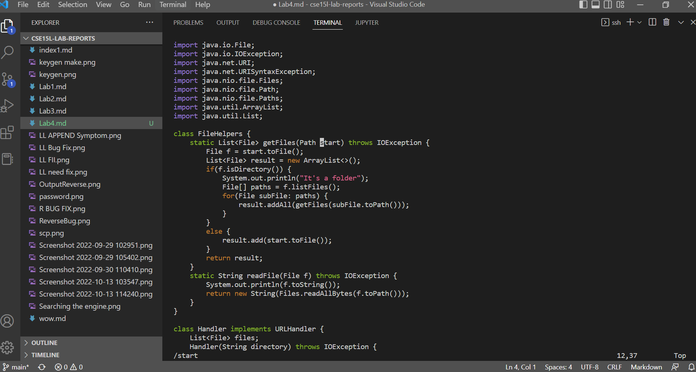
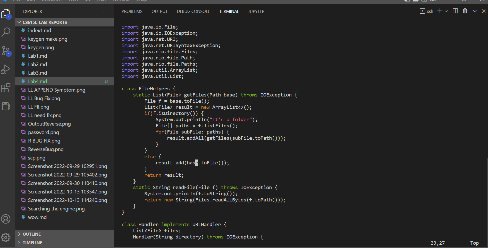

## Using Vim

# Changing Start to Base

To change thevariable start to base in DocSearchServer.java, I fist opened the file using vim with:

``` vim DocSearchServer.java ```

This opened the file to look like this


Then I beagn by searching for the word start using ``` /start <Enter> ``` shown below



Once I was on the first instance of start I used ``` ce base <Escape> ``` which entered insert mode ` e ` deleted the word then I changed to base then exited insert mode


After changing the first start and exited insert mode I then pressed ``` n. ``` to go to the next instance of start and do the same edit to this start.


I then did the same process f ``` n. ``` to do edit the last instance of start that hasd to be inserted.



To exit I used ``` :wq ``` to save and exit and save vim.


# Vim vs. Other Text Editor

I did the task above timed on both vim and on VS Code. During this using only vim it took about 45 seconds including using scp to bvring the file onto the remote server. On the other hand VS Code took and even longer amount of aboutr 2 minutes. There werent more difficulties to say it was just more to do and more to scp the file.

To answeer the first question, If I am forced to work on a remote server I would much rather work with vim. Vim is already standard on most servers and it just took less time to do many of the tasks that I would have to do on the remote server. Replceing can happen in less than 3 key strokes after the first time and many times it is easier to find and edit things in vim as it is easy to find and identify elements that you might have to change. If I was no runnig on a remoted server I would use some sort of IDE or VS code just becasue it is the thing I am most used to and have used them for most of my computer science career. Also just striaght up writing code is much better in an IDE becasue it can tell me many of my mistakes before running the code or debuggingand it is more natural to edit multiple files at once on an IDE rather than vim. It all just depends on if i am on a remoted server or not and wat I am doing in terms of task.
